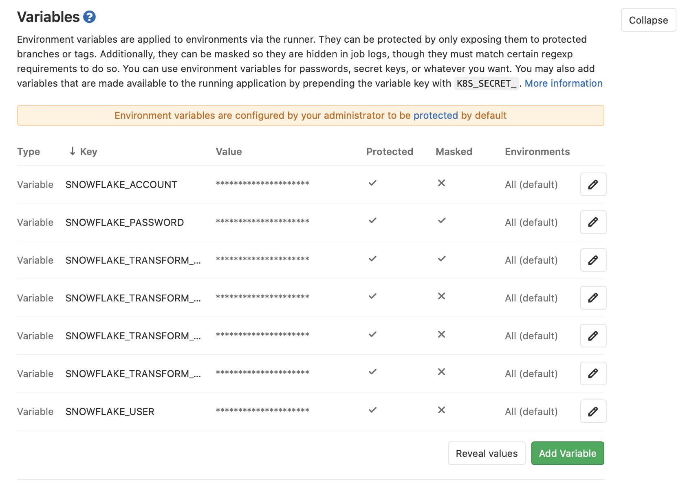

title: How to setup dbt DataOps with GitLab CI/CD for a Snowflake datawarehouse
date: 5th June 2020
author: Robin Beer
summary: Use the data build tool (dbt) to write DRY SQL.
tags: HowTo, backend, dataops, GitLab
status:draft

If you are working with databases, you probably also work with SQL.
Although SQL is simple to learn, you might already have asked yourself whether it wasn't possible to write object-oriented SQL... :thinking:

There is: using dbt! :) 

The data build tool (dbt) is "the T in ELT" - hence the "transform" in Extract Load Transform. If you are new to cloud data warehouses, ELT etc. you might want to read the article [USING DBT TO EXECUTE ELT PIPELINES IN SNOWFLAKE](https://community.snowflake.com/s/article/Using-DBT-to-Execute-ELT-Pipelines-in-Snowflake).

However, to get up and running within 15 min with a simple dbt example and GitLab CI configuration, I invite you to read this article.


https://www.youtube.com/watch?v=-XBIIY2pFpc&feature=youtu.be&t=1305

https://gitlab.com/gitlab-data/analytics/-/blob/master/transform/snowflake-dbt/snowflake-dbt-ci.yml


## Local installation

First of all, create a new virtual environment of your choice to install dbt, for example using conda:

```bash
conda create -n dbt_test python=3.8
```

Then, install dbt using pip:

```bash
pip install dbt
```

When completed, you can create an example project:

```bash
dbt init dbt_test
```

## bigquery or snowflake config

If you do not yet have a cloud data warehouse I invite you to follow the [official dbt tutorial to get started](https://docs.getdbt.com/tutorial/setting-up) in which you will setup BigQuery. If you already have a cloud data warehouse, check out the [supported databases](https://docs.getdbt.com/docs/supported-databases).

As indicated by the title, I will show how to proceed with a snowflake database.


## Write your first dbt models

tbd

## GitLab CI/CD pipeline

First, create a repository on your GitLab instance and push your local code to it. Then, add your snowflake environment variables under `Settings -> CI/CD -> Variables (Expand)` by clicking on `Add Variable`:



To load these environment variables into the pipeline, create the file `profile/profiles.yml` with the following content (inspired by [GitLab's profiles.yml](https://gitlab.com/gitlab-data/analytics/-/blob/master/transform/snowflake-dbt/profile/profiles.yml)):

```yml
my-snowflake-db:
  target: dev
  outputs:
    dev:
      type: snowflake
      threads: 1
      account: "{{ env_var('SNOWFLAKE_ACCOUNT') }}"
      user: "{{ env_var('SNOWFLAKE_USER') }}"
      password: "{{ env_var('SNOWFLAKE_PASSWORD') }}"
      database: "{{ env_var('SNOWFLAKE_TRANSFORM_DATABASE') }}"
      role: "{{ env_var('SNOWFLAKE_TRANSFORM_ROLE') }}"
      warehouse: "{{ env_var('SNOWFLAKE_TRANSFORM_WAREHOUSE') }}"
      schema: "{{ env_var('SNOWFLAKE_TRANSFORM_SCHEMA') }}"
      client_session_keep_alive: False

```

Now, add the following `.gitlab-ci.yml` within your GitLab repository:

```bash
image: python:latest

variables:
  PIP_CACHE_DIR: "$CI_PROJECT_DIR/.cache/pip"

cache:
  paths:
    - .cache/pip
    - venv/

before_script:
  - python -V  # Print out python version for debugging
  - pip install virtualenv
  - virtualenv venv
  - source venv/bin/activate
  - pip install dbt
  - export CI_PROFILE_TARGET="--profiles-dir profile --target dev"
  - echo $CI_PROFILE_TARGET

run:
  script:
     dbt run $CI_PROFILE_TARGET 
```

When committing this change, the CI/CD pipeline should be automatically triggered. If all environment variables are set correctly and the dbt models worked locally, the pipeline should also succeed. Congratulations!

## Conclusion

dbt stands for "data build tool" and can be described as "the T in ELT".
It's a tool that is used by a growing community to write DRY SQL, create dbt packages and add DataOps to it.

With this article, you have locally installed it, built your own simple dbt model and connected and tested it on snowflake (or BigQuery).

Finally, you have set up a CI/CD pipeline on GitLab to complete the DataOps setup.

Now, if dbt rose your interest, join the [dbt slack channel](https://community.getdbt.com) or check out the [information on how the GitLab Data Team leverages dbt](https://about.gitlab.com/handbook/business-ops/data-team/) for more detailed insights in how dbt can be used.

See you in the community!

Robin